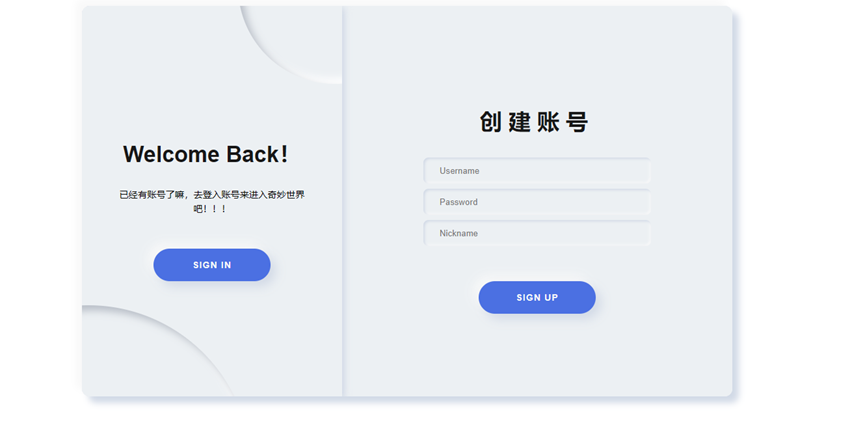
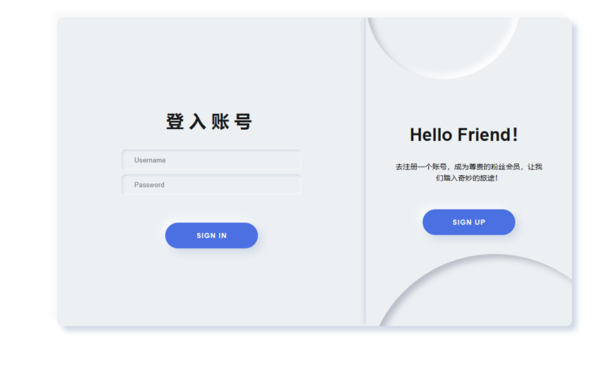
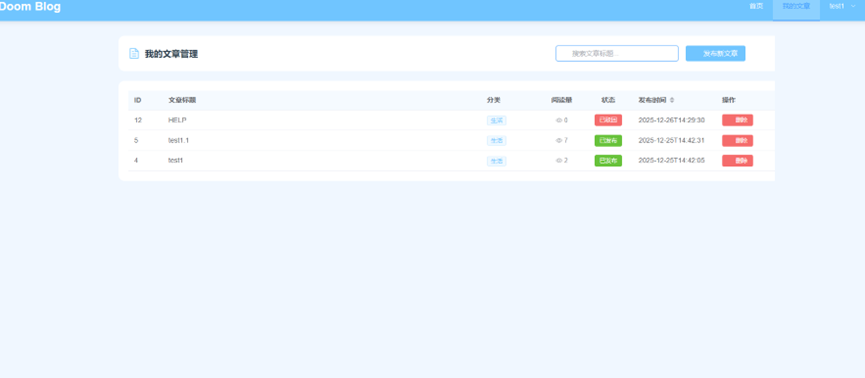
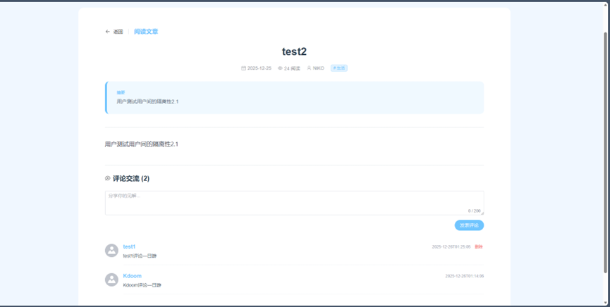
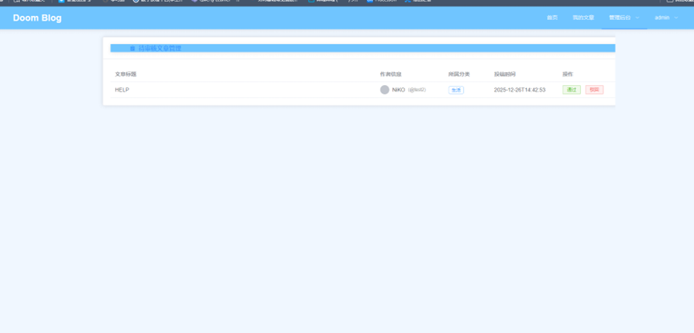
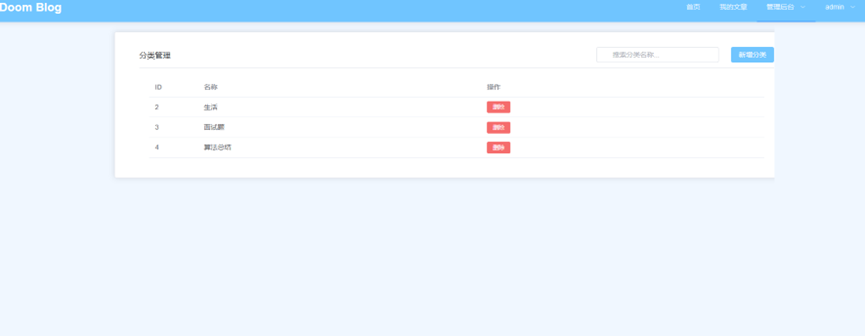
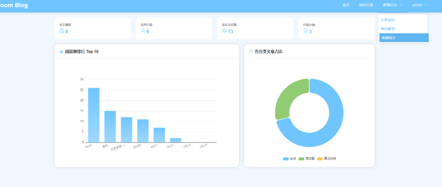

# 大学生期末作业之个人博客系统（前后端）技术架构

## 一、项目概述

基于前后端分离架构sprinboot3+vue3的个人博客系统，后端提供核心接口服务，前端负责页面展示与交互，支持用户认证、文章管理、评论互动、分类管理、数据统计等完整功能。

## 二、技术栈详情

### （一）后端（blog-parent）

- **核心框架**：Spring Boot 3.4.0（应用核心）、Spring Security 6.x（安全认证）
- **数据访问**：MyBatis-Plus 3.5.7（数据库操作）、MySQL 8.0+（数据存储）、MySQL Connector J（数据库驱动）
- **认证授权**：JJWT 0.12.6（JWT 令牌处理）、BCrypt（密码加密）
- **Web 组件**：Spring Web（RESTful API 开发）、Spring Validation（参数校验）
- **工具类**：Lombok（代码简化）、自定义 Result/JwtUtils 工具类
- **开发环境**：Java 17、Maven（构建工具）、端口 8080

### （二）前端（blog-ui）

- **核心框架**：Vue 3.5.24（前端核心）、Vue Router 4.6.4（路由管理）、Vite 7.2.4（构建工具）
- **UI 组件**：Element Plus 2.13.0（UI 组件库）、@element-plus/icons-vue 2.3.2（图标库）
- **数据相关**：Axios 1.13.2（HTTP 请求）、ECharts 6.0.0（数据可视化）、Pinia 3.0.4（状态管理，预留）
- **富文本**：@kangc/v-md-editor 2.3.18（Markdown 编辑 / 预览）、highlight.js 11.11.1（代码高亮）

## 三、核心架构设计

### （一）整体架构

前后端分离，通过 RESTful API 通信；后端采用 Spring Boot 单体架构（多模块 Maven 项目），前端为 SPA 单页应用。

### （二）后端架构分层

1. 控制器层（Controller）：处理请求（AuthController、PublicController 等）
2. 过滤器层（Filter）：JWT 认证拦截（JwtAuthenticationFilter）
3. 服务层（Service）：业务逻辑处理（AuthService 等）
4. 数据访问层（Mapper）：数据库交互（UserMapper、ArticleMapper 等）
5. 配置层（Config）：安全配置、元数据填充等
6. 工具层（Utils）：统一响应、JWT 处理等

### （三）前端架构分层

1. 视图层（Views）：登录页、首页、文章详情、管理员页面等
2. 路由层（Router）：嵌套路由 + 懒加载，管理页面导航
3. 工具层（Utils）：Axios 封装（统一请求 / 拦截器 / Token 管理）
4. 布局层（Layout）：统一导航栏布局，支持角色权限控制

## 四、核心功能模块

- 用户认证：注册 / 登录（JWT 无状态认证）、角色权限（ADMIN/USER）
- 文章管理：发布 / 审核 / 查询 / 编辑 / 删除，支持 Markdown 渲染
- 评论互动：发表 / 查询评论，关联用户信息展示
- 分类管理：管理员增删改查分类，文章归类筛选
- 数据统计：平台概览（文章 / 用户 / 分类数）、阅读量排行、分类占比可视化

## 五、部署要求

- 后端：JDK 17+、Maven 3.6+、MySQL 8.0+，打包为 JAR 运行
- 前端：npm 依赖安装，支持开发环境热更新、生产环境构建部署

## 六、效果展示

## 七、未来改进方向

1. 目前其实没有将实现正确的三层架构，将service层代码单独提出来，实现真正的**低耦合、高内聚**
2. 而且有些业务逻辑有待完善：
	- 当管理员驳回用户文章时应该给出理由
	- 当分类下有文章时不能删除该分类（2天速成下来的漏洞）
	- 其余有待发现

